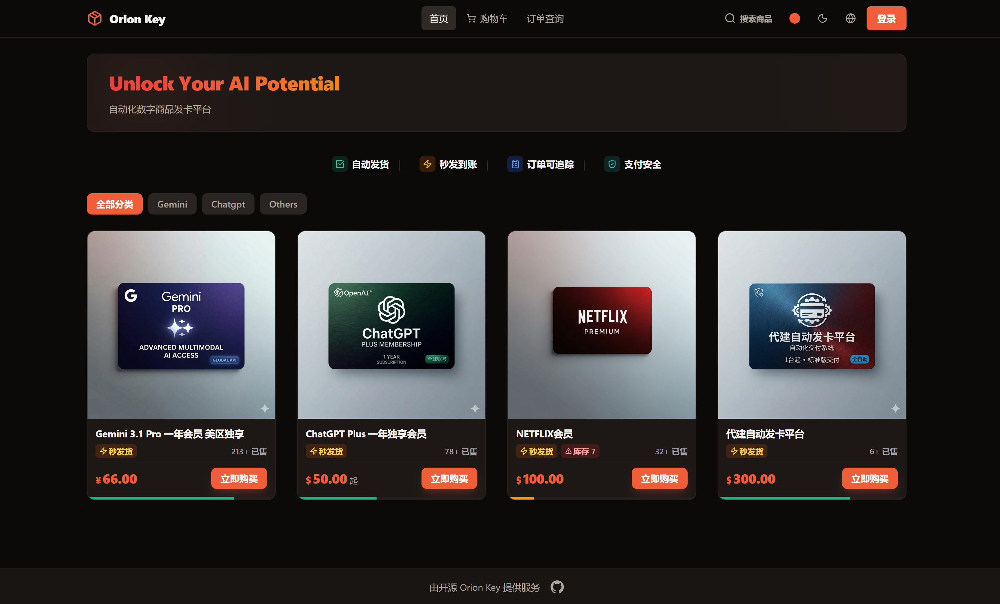
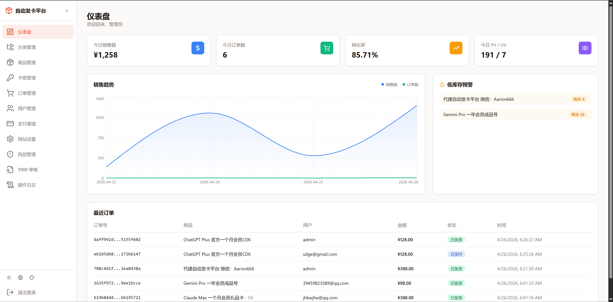
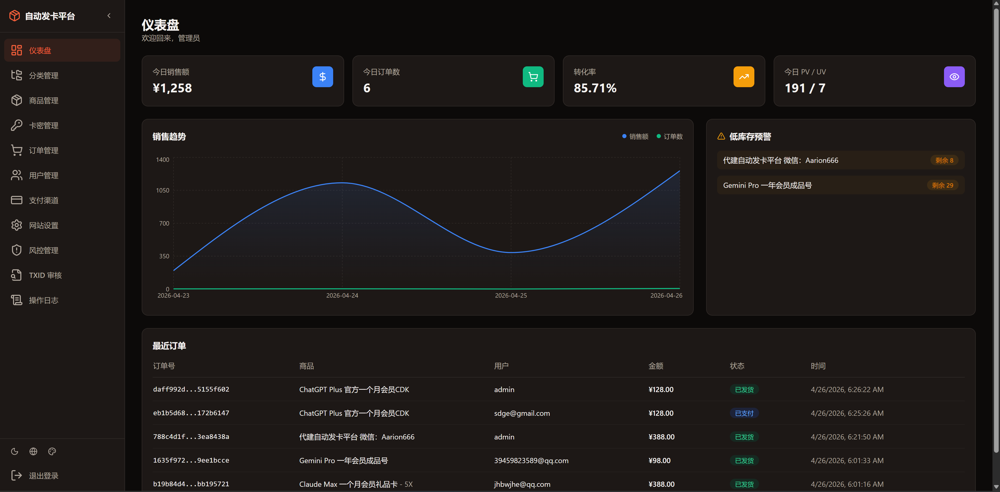

<div align="center">

# Orion Key

**Automated Digital Goods Delivery Platform**

自动化数字商品（卡密）发卡平台

[](LICENSE)


[简体中文](README.md) | English

</div>

---

## Screenshots

| Storefront (Light) | Storefront (Dark) |
|:---:|:---:|
|  |  |

| Admin Panel (Light) | Admin Panel (Dark) |
|:---:|:---:|
|  |  |

---

## Online Demo

> Live demo environment is open — log in to the admin panel to explore the full feature set.

| | URL |
|---|---|
| 🛒 **Storefront** | <https://www.orionkey-demo.com/> |
| 🛠️ **Admin Panel** | <https://www.orionkey-demo.com/admin> |
| 🔑 **Admin Credentials** | `admin` / `123456` |

---

## Features

|  |  |
|---|---|
| 🛒 **Auto Delivery** — Automatic key distribution after payment | 🎨 **Theming** — Light/dark mode with multiple accent colors |
| 📦 **Product Management** — Categories, stock control, bulk key import | 🔒 **Security** — Stateless JWT auth + BCrypt encryption |
| 💳 **Multi-Payment** — Extensible payment architecture (WeChat/Alipay) | 🛡️ **Risk Control** — IP rate limiting, brute-force protection, order anti-fraud |
| 📊 **Admin Dashboard** — Sales overview, order/user/site management | 🔍 **Order Tracking** — Query keys by order number (guest & member) |
| 🛍️ **Shopping Cart** — Multi-item checkout in one order | ⚙️ **Site Config** — Announcements, popups, maintenance mode via admin panel |

---

## Integrated Payment Channels

| Channel | Integration | Notes |
|---------|------------|-------|
| Alipay | Epay (Aggregator) | Via third-party Epay payment platform |
| WeChat Pay | Epay (Aggregator) | Via third-party Epay payment platform |
| Alipay | Native | Requires business license (Alipay Open Platform) |
| WeChat Pay | Native | Requires business license (WeChat Pay Merchant) |
| USDT (TRC-20) | BEpusdt Self-hosted | On-chain auto-confirmation, no third-party custody |
| USDT (BEP-20) | BEpusdt Self-hosted | On-chain auto-confirmation, no third-party custody |

> Extensible payment architecture — configure and switch channels freely via admin panel.

> 💡 **Epay Onboarding Referral** (CN mainland users): <https://vip1.zhunfu.cn/user/?invite=X1NUVw>

---

## Tech Stack

| Layer | Technologies |
|-------|-------------|
| **Frontend** | Next.js 16 · React 19 · TypeScript · Tailwind CSS 3 · shadcn/ui |
| **Backend** | Spring Boot 3.4 · Java 22 · Spring Data JPA · Spring Security |
| **Database** | PostgreSQL 18+ |
| **Auth** | JWT (jjwt) · BCrypt |
| **Build** | pnpm (frontend) · Maven (backend) |

### Monorepo Structure

> pnpm workspaces monorepo — frontend and backend managed together.

```
orion-key/
├── apps/
│   ├── web/                          # Next.js frontend
│   │   ├── app/
│   │   │   ├── (store)/              # Storefront routes (home, product, cart, order, payment…)
│   │   │   └── admin/                # Admin panel routes (dashboard, products, keys, orders…)
│   │   ├── features/                 # Business feature modules
│   │   ├── services/                 # API client layer (unified backend calls)
│   │   ├── hooks/                    # Custom React hooks
│   │   ├── components/               # Shared UI components (shadcn/ui)
│   │   ├── types/                    # TypeScript type definitions
│   │   └── next.config.mjs           # Next.js config (includes API proxy rewrites)
│   │
│   └── api/                          # Spring Boot backend
│       └── src/main/
│           ├── java/com/orionkey/
│           │   ├── controller/       # REST controllers (storefront + admin)
│           │   ├── entity/           # JPA entities (16 tables)
│           │   ├── repository/       # Data access layer
│           │   ├── service/          # Business logic layer
│           │   ├── config/           # Security, JWT, CORS config
│           │   └── model/            # DTOs / VOs
│           └── resources/
│               ├── application.yml   # App config (DB, JWT, mail, uploads, etc.)
│               └── data.sql          # Seed data (admin account, site config, payment channels)
│
├── docker-compose.yml                # Docker Compose orchestration (production / local)
├── .env.example                      # Environment variable template
└── pnpm-workspace.yaml               # Monorepo workspace declaration
```

---

## Prerequisites

Ensure the following tools are installed before getting started:

| Tool | Version | Notes |
|------|---------|-------|
| Java | 22+ | Backend runtime |
| Maven | 3.9+ | Backend build tool |
| Node.js | 20+ | Frontend runtime |
| pnpm | 9+ | Frontend package manager (`npm i -g pnpm`) |
| PostgreSQL | 18+ | Database — create a database and user before starting |

---

## Configuration

Main config file: `apps/api/src/main/resources/application.yml`

All settings support **environment variable overrides** (`${ENV_VAR:default}`). Edit the yml directly for local dev; use env vars for production.

### Database

```yaml
spring:
  datasource:
    url: ${DB_URL:jdbc:postgresql://localhost:5432/orion_key}
    username: ${DB_USERNAME:orionkey}
    password: ${DB_PASSWORD:your_password}
```

Tables are auto-created on first startup (`ddl-auto: update`). After startup, run the seed SQL once to insert admin account, site config, and payment channels:

```bash
psql -U orionkey -d orion_key -f apps/api/src/main/resources/data.sql
```

> The SQL uses `WHERE NOT EXISTS` guards — safe to run multiple times.

### JWT Authentication

```yaml
jwt:
  secret: ${JWT_SECRET:<generate with: openssl rand -base64 48>}
  expiration: 86400000  # 24 hours
```

For production, you **must** inject a random secret via the `JWT_SECRET` environment variable (at least 256 bits):

```bash
openssl rand -base64 48
```

### Password Encryption Mode

```yaml
security:
  password-plain: ${PASSWORD_PLAIN:true}  # true=plaintext (dev), false=BCrypt (production)
```

- **Local dev**: `true` (default) — passwords stored in plaintext for easy debugging
- **Production**: set to `false` to enable BCrypt — **reset all user passwords before switching**

### Email

```yaml
spring:
  mail:
    host: ${MAIL_HOST:smtp.example.com}
    port: ${MAIL_PORT:465}
    username: ${MAIL_USERNAME:your@email.com}
    password: ${MAIL_PASSWORD:your_password}

mail:
  enabled: ${MAIL_ENABLED:true}       # Master switch — set false to disable all emails
  site-url: ${MAIL_SITE_URL:https://your-domain.com}
```

### File Uploads

```yaml
upload:
  path: ${UPLOAD_PATH:./uploads}                # File storage path
  url-prefix: ${UPLOAD_URL_PREFIX:/api/uploads}  # Access URL prefix
```

---

## Deployment

> For full production setup (server bootstrap, Nginx/HTTPS, CI/CD, BEpusdt USDT payments, etc.), see [`docs/PRODUCTION_SETUP_GUIDE.md`](docs/PRODUCTION_SETUP_GUIDE.md). This section covers the minimal startup path only.

### Option A: Docker (Recommended)

The repo ships `docker-compose.yml` orchestrating **api / web / bepusdt** containers; **PostgreSQL and Nginx are not included** — bring your own.

Public images are published to GHCR; the `:latest` tag tracks the latest release and can be pulled anonymously:

- `ghcr.io/rivenlau/orion-key-api:latest`
- `ghcr.io/rivenlau/orion-key-web:latest`

```bash
# 1. Prepare .env (see "Configuration" section above for variable meanings)
cp .env.example .env

# 2. Pull images and start
docker compose pull
docker compose up -d

# 3. Tail logs
docker compose logs -f
```

> 💡 **For production**, pin to a specific version (e.g. `:v1.0.0`) by overriding `API_IMAGE` / `WEB_IMAGE` in `.env` — easier rollback and multi-host consistency.

> Uploaded files persist via the `./uploads` volume mount and survive container rebuilds. Add an Nginx reverse proxy in front for HTTPS and static assets in production.

### Option B: Non-Docker (Direct Run)

For local development or single-host setups. Requires Java 22 / Maven 3.9+ / Node.js 20+ / pnpm 9+ / PostgreSQL 18+.

> ⚠️ **Timezone notice**: Docker deployments inject `TZ=Asia/Shanghai` via compose. For non-Docker setups, you must configure the process timezone yourself — otherwise order timestamps, expiry checks, and on-chain verification will be off by 8 hours. Pick either:
>
> ```bash
> # Option A: change system timezone (affects all processes)
> sudo timedatectl set-timezone Asia/Shanghai
>
> # Option B: inject TZ env var per process
> export TZ=Asia/Shanghai
> ```

```bash
# Backend (port 8083)
cd apps/api
mvn spring-boot:run

# Frontend (port 3000, in a new terminal)
cd apps/web
pnpm install
pnpm dev
```

Or start the frontend from the monorepo root:

```bash
pnpm install
pnpm dev:web
```

> **API Proxy**: `next.config.mjs` rewrites `/api/*` to `http://localhost:8083` automatically — no CORS setup needed.

### Verify

- Health check: `GET http://localhost:8083/api/categories`
- Admin login: `admin` / `admin123`

---

## AI Store (Not a Demo)

[](https://www.orionkey.shop/)

---

## Telegram Group

[](https://t.me/+7Gx0vtwWixI3ODZh)

---

## Business Inquiries

Custom card-key platform development services available — including dedicated deployment, custom feature development, payment integration, and operations support.

> 📩 WeChat: **Aarion666**

<p align="center">
  
</p>

---

## Star History

<a href="https://star-history.com/#RivenLau/orion-key&Date">
  <picture>
    <source media="(prefers-color-scheme: dark)" srcset="https://api.star-history.com/svg?repos=RivenLau/orion-key&type=Date&theme=dark" />
    <source media="(prefers-color-scheme: light)" srcset="https://api.star-history.com/svg?repos=RivenLau/orion-key&type=Date" />
    
  </picture>
</a>

---

## License

[MIT](LICENSE) © 2026 Riven
